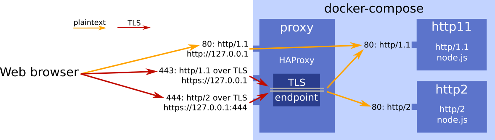

# HTTPlab

A reverse web-proxy and backend server setup for easy packet capture
of clear-text HTTP/1.1, HTTP/2, and Websocket traffic. Sample pcaps
included.

## Background

For implementing protocol parsers or simply to learn about modern web
traffic it's still handy to have pcaps of HTTP traffic that's normally
transferred over TLS, particularly via http/2. This repo provides a
docker-compose application that runs a reverse proxy terminating TLS
with a self-signed certificate, forwarding traffic to two node.js
servers that speak unencrypted http/1.1 and http/2. They serve the
socket.io [chat application](https://socket.io/get-started/chat/),
adding websocket use on top of HTTP. You can easily serve other
content as well. A `tcpdump` of the web server traffic provides pcaps
with unencrypted flows.

## Network topology

This project uses the following containers:

An [HAProxy](http://www.haproxy.org) instance in the `proxy` container
offers three TCP ports to the host: plain HTTP/1.1., HTTP/1.1 over
TLS, and HTTP/2 over TLS. It acts as a TLS terminator with a
self-signed cert. It forwards the plain HTTP payload over unencrypted
connections to two node.js servers, one speaking HTTP/1.1 (`http11`),
the other HTTP/2 (`http2`).

The following URLs are live once docker-compose is up:

- [http://127.0.0.1](http://127.0.0.1): unencrypted HTTP/1.1, served by the `http11` container on port 80
- [https://127.0.0.1](https://127.0.0.1): HTTP/1.1 over TLS, served by the `http11` container on port 80
- [https://127.0.0.1:444](https://127.0.0.1:444): HTTP/2 over TLS, served by the `http2` container on port 80

Note that the TLS certificate in use is self-signed, so you'll need to
click through your browser's warning dialog once.

## Protocol details

For http/1.1, the WebSocket traffic happens over the usual
connection-level upgrade mechanism outlined in
[RFC6455](https://tools.ietf.org/html/rfc6455).  For http/2, it uses
the `SETTINGS_ENABLE_CONNECT_PROTOCOL` value in a settings frame, with
a subsequent `CONNECT` as specified in
[RFC8441](https://tools.ietf.org/html/rfc8441).

NOTE: the web server currently seems to reject the websocket CONNECT
over http/2 with a 405. Patches to improve this are welcome. The chat
application itself works because socket.io falls back on polling.

## Launching the servers

To start the network, say `docker-compose up` from this folder. You'll
see something like this:

    proxy_1   | Note: setting global.maxconn to 493.
    proxy_1   | Available polling systems :
    proxy_1   |       epoll : pref=300,  test result OK
    proxy_1   |        poll : pref=200,  test result OK
    proxy_1   |      select : pref=150,  test result OK
    proxy_1   | Total: 3 (3 usable), will use epoll.
    proxy_1   |
    proxy_1   | Available filters :
    proxy_1   |     [SPOE] spoe
    proxy_1   |     [CACHE] cache
    proxy_1   |     [FCGI] fcgi-app
    proxy_1   |     [TRACE] trace
    proxy_1   |     [COMP] compression
    proxy_1   | Using epoll() as the polling mechanism.
    http11_1  | speaking http on *:80
    http2_1   | speaking http2 on *:80

At this point you can visit any of the three localhost URLs shown
above with your browser, and you should see a basic but functional
chat app. Note that the backend between the plaintext and
HTTP/1.1-over-TLS URLs is shared, so you'll see chat messages
broadcast across them.

## Capturing pcaps

To capture raw traffic you'll need to know the IP addresses of the
backend servers and the right interface on your local host to sniff
on. Let's cover them in turn. To learn about the network, say `docker
network inspect httplab_default`, which is the name `docker-compose`
chooses for your network.  The output includes IP addresses for the
two web servers, e.g. as follows:

    "Containers": {
        "05e497beddfc22c74a57d055ab9d1fd9183f375bf296146ee7fb30eb20e279dc": {
            "Name": "httplab_http2_1",
            "EndpointID": "b83ce30ddc2d0d63741fbebd40654adc5ed43084c06e8b27f5665cbf7a45d986",
            "MacAddress": "02:42:ac:13:00:04",
            "IPv4Address": "172.19.0.4/16",
            "IPv6Address": ""
        },
        "d698292f026090bf6a1942f14c225b97aa11df98962cf00462ce77d6bb7dea9f": {
            "Name": "httplab_http11_1",
            "EndpointID": "576939974e7afc5cb1b429bc347c031ac10d1e16df8cfa90011bee650f517ba4",
            "MacAddress": "02:42:ac:13:00:03",
            "IPv4Address": "172.19.0.3/16",
            "IPv6Address": ""
        },
        ...

At this point a tcpdump of port 80 on the `http11` or `http2`
addresses (172.19.0.3 or 172.19.0.4 in the above) will show you
unencrypted HTTP/1.1 or HTTP/2 traffic, respectively. The interface to
sniff on depends on your Docker setup. Most likely it's a bridge
device spun up by docker-compose. You can identify it from the output
of `docker network ls`:

    $ docker network ls | grep httplab_default
    500b158c17e5        httplab_default     bridge              local

In my case, `ifconfig` shows a corresponding bridge device called
`br-500b158c17e5`. So, piecing it all together, the following captures
clear-text http/2 traffic:

    # tcpdump -n -s0 -i br-500b158c17e5 -w http2.pcap host 172.19.0.4

Those pcaps likely have invalid checksums due to checksum offloading,
so to make life easier for people consuming your pcaps, clean them up
by running them through `tcprewrite -C`.

## Sample pcaps

The `pcaps` folder has sample captures for websockets over HTTP/1.1
and HTTP/2, recorded as described above.

## Serving additional web content

The node webservers serve up anything in `/opt/webserver`, so to
change that you can simply copy additional content into the relevant
container. For example, after saying

    docker cp foo.html httplab_http11_1:/opt/webserver

you'll see the contents of foo.html at http://127.0.0.1/foo.html.

## Using other protocols

There's nothing HTTP-specific in the HAProxy configuration, so you can
easily extend this setup to other protocols carried over TLS. You just
need an endpoint serving the protocol unencrypted.
